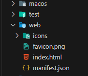
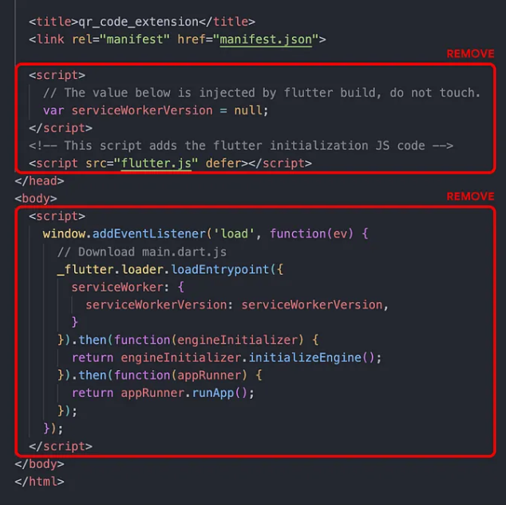
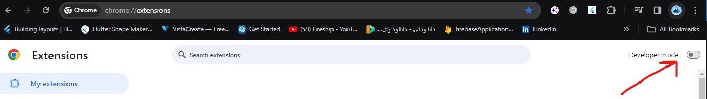
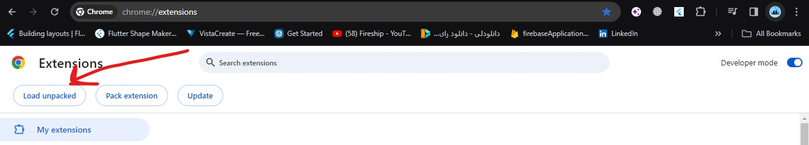
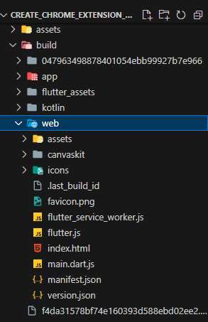
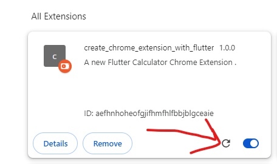

## 1. Research: build a Chrome Extension with Flutter

- Keywords:
  - What’s a Chrome extension?
  - Create chrome extension using flutter. 
  - Modifying to run as an extension. 
  - Set the extension view dimensions.
  - Make some changes in manifest.json.
  - How to build and run as a Chrome extension.

- Video Title: How to Build A Chrome Extension with Flutter[2023]

## 2. Research: Competitors

**Flutter Videos/Articles**
- https://blog.codemagic.io/how-to-build-a-chrome-extension-with-flutter-web/
- https://blog.codemagic.io/how-to-build-a-chrome-extension-with-flutter-web/
- https://blog.codemagic.io/how-to-build-a-chrome-extension-with-flutter-web/
- https://blog.codemagic.io/how-to-build-a-chrome-extension-with-flutter-web/
- https://dev.to/sahibul_nf/make-your-flutter-app-the-google-chrome-extension-4d68
- 14K  - https://www.youtube.com/watch?v=dUxp0BFf3eY
- 3.4k - https://www.youtube.com/watch?v=oIfs5uxysXc
- 1.6K - https://www.youtube.com/watch?v=7nHzIIqT1DQ
- 783  - https://www.youtube.com/watch?v=ifoSMW1J1-o


**Android/Swift/React Videos**
- NA

**Great Features**
- NA

**Problems from Video**
- How do you increase the size of the extension? -> **Answer:** To increase the size of the Chrome extension , you can adjust the height and width in the index.html in the Web file. 
```dart
     <html style="height: 800px; width: 600px">
    </html>
  ```
- do Chrome extension api needed? -> **Answer:** Yes, if you are building a Chrome extension using Flutter, you will need to use the Chrome extension API to access features and data specific to the Chrome browser. This API allows you to access information about the current tab, create notifications, and interact with other parts of the browser.To use the Chrome extension API in a Flutter app, you will need to use the js package to call the API from Dart 

- How can I query webpage's elements content by extension? -> **Answer:** To query webpage's elements content by an extension, you can use the content_script field in the manifest.json file of your Chrome extension to inject JavaScript code into the webpage. The injected JavaScript code can then use the querySelector or querySelectorAll method to select and query the desired webpage elements
```dart
    "content_scripts": [
    {
      "matches": ["<all_urls>"],
      "js": ["content_script.js"]
    }
  ]
  // Create a JavaScript file named content_script.js that contains the code  to query the webpage elements.
   function queryElements() {
    const elements = document.querySelectorAll('div.example');
    const results = [];
    for (const element of elements) {
     results.push(element.innerText);
     }
     chrome.runtime.sendMessage({type: 'QUERY_RESULT', data: results});
}
    window.onload = queryElements;
  //In your Flutter extension, create a background script that listens for the message sent from the content_script.js file.
  chrome.runtime.onMessage.addListener(function(request, sender, sendResponse) {
   if (request.type === 'QUERY_RESULT') {
     console.log(request.data);
  }
});
  ```

**Problems from Flutter StackOverflow**
- https://stackoverflow.com/questions/76883562/how-can-i-build-a-chrome-extension-using-flutter

## 3. Video Structure
1. Main topics
   - What’s a Chrome extension? Extensions are lightweight software programs that can be installed in the browser. They are easily accessible inside the browser and help in enhancing the experience of the user.
2. Create chrome extension using flutter 
   - create a new project for your Flutter.Before proceeding further, test the demo Flutter app by running on Chrome (you can test on any browser but as we’ll be building a chrome extension, so anyways you need to have Chrome installed on your system). if flutter web is not enabled, then enable it by
    ```dart
       flutter config --enable-web
     ```
     If you are inside VS Code, just select Chrome as the target platform (from the bottom bar) and press “fn + F5” to build and launch the app. Otherwise, you can use the following command to run the app on Chrome:
     ```dart
       flutter run -d Chrome
     ```
   - Modifying to run as an extension: Remove non-supported scripts from index.html, Navigate to web/index.html file and remove all the <script>..</script> tags,
    
    
    Then only insert the following <script> tag inside the <body><script>:
     ***chrome Extension using flutter***
     ```dart
         <script src="main.dart.js" type="application/javascript"></script>
     ```
   -  Set the extension view dimensions.  
     - you need to explicitly specify the width and height values of the extension view inside the HTML.Just replace the starting <html> tag with the following:
       ```dart
         <html style="height: 600px; width: 350px">
      ```     
 
   - Make some changes in manifest.json.
     - Navigate to web/manifest.json file and replace the entire content with the following: 
      ```dart
         {
        "name": "create_chrome_extension_with_flutter",
        "description": "A new Flutter Calculator Chrome Extension .",
        "version": "1.0.0",
        "content_security_policy": {
        "extension_pages": "script-src 'self'; object-src 'self'"
      },
          "action": {
          "default_popup": "index.html",
          "default_icon": "/icons/Icon-192.png"
       },
         "manifest_version": 3
      }
      ```  
   - With the required changes done, you are ready to build and run it as a Chrome extension.  
     - RUN this command.
         ```dart
             flutter build web --web-renderer html --csp
         ```  
     - You will find the generated files inside build/web folder present in your root Flutter project directory.  
     - To install and use this extension, go to this URL from the Chrome browser [Chrome Extension Url](chrome://extensions)
     - This page lists all the Chrome extensions if you have any installed.
       - Enable the Developer mode toggle present in the top-right corner of the webpage.
       
       - Click Load unpacked.
       
       - Select the <flutter_project_dir>/build/web folder.
       
       
     - You will see that the new extension is now added to that page.   
       - The extension will get automatically installed, you will be able to access it just like any regular extension by clicking on the extension  icon present in the top bar (it can also be pinned for easy access).
     - whenever we want to add a new change in the extension use
      ```dart
             flutter build web --web-renderer html --csp
         ```  
     - to create a new build which has new changes and after that,   
      

    